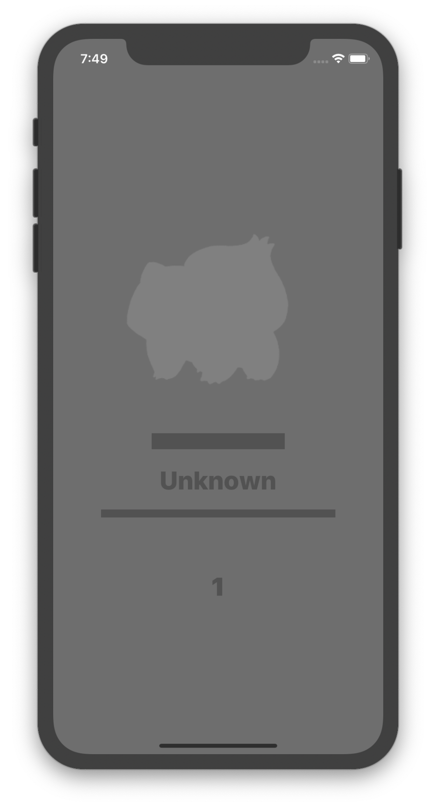
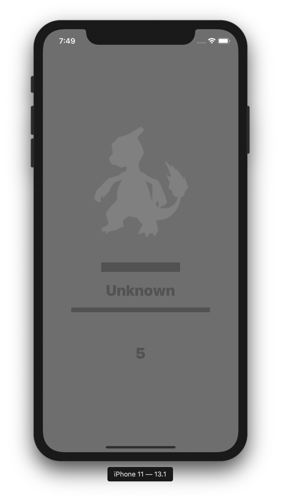
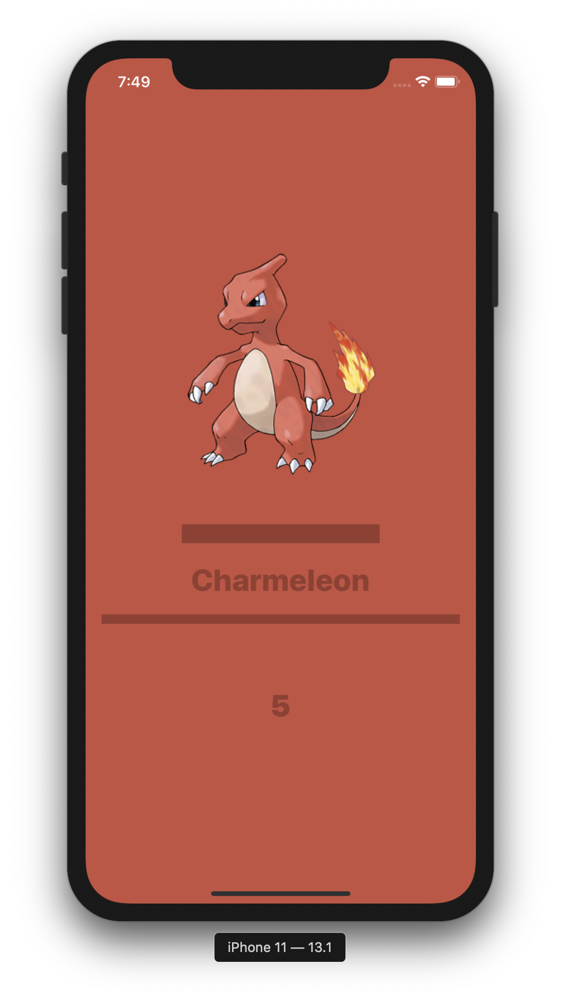
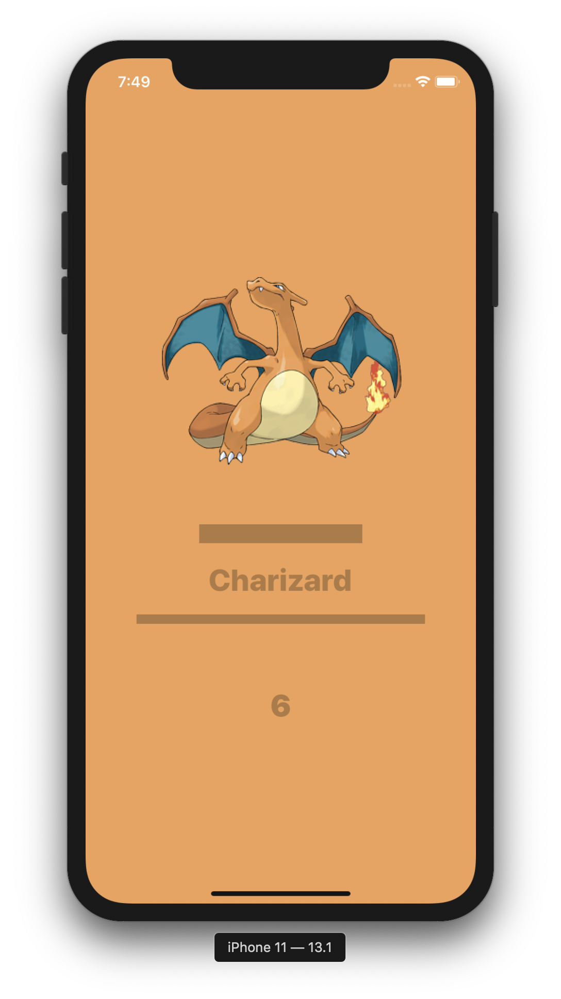

### Assignment #4

# Pokémdex 1

##### Autorzy:

1. Artem Lysevych
2. Jan Góralski

### Opis zadania

Celem zadania jest stworzenie aplikacji **Pokédex**. Aplikacja wygląda bardzo podobnie do poprzedniej pracy domowej, więc polecam Wam ją zrobić w takich samych teamach. Możecie zacząć od własnego rozwiązania (polecam!) lub ze starter projektu dołączonego do tego repozytorium.

W tym zadaniu wprowadzamy funkcjonalności związane z sieciowością. Nie będziemy pobierać `pokemon_list.json` z pliku lokalnego, tylko z internetu 😱.

Wykorzystamy do tego api Switter. Dokumentacja jest dostępna [tutaj](https://github.com/DaftMobile/switter).

>Samo API jest dostępne pod adresem [https://switter.app.daftmobile.com](https://switter.app.daftmobile.com).

---

Sama aplikacja jest bardzo podobna do aplikacji z poprzedniego tygodnia.

1. `UILabel` zawierający nazwę Pokémona
2. `UILabel` zawierający numer Pokémona
3. 2x `UIView` służące jako separatory
4. `UIImageView` zawierający obrazek pokemona (pobrany z endpointu `/pokemon/:number/image`)

#### Pobieranie

Główną funkcjonalnością aplikacji jest zmienianie aktualnie wybranego Pokémona przy pomocy tapnięcia. Aplikacja wykorzystuje Auto Layout. Będziesz również musiał zmieniać kolory aplikacji w zależności od aktualnie wybranego Pokémona.

Wymagania dotyczące layoutu są takie same jak w poprzedniej aplikacji. Jedyne co musicie zrobić, to obniżenie nazwy Pokémona i dodanie obrazka.

#### Fetch

1. Aplikacja **nie** powinna korzystać z endpointu do pobierania wszystkich Pokémonów!
2. Wchodząc do aplikacji mamy jedynie numer aktualnego Pokémona (1).
3. Tapnięcie powoduje **pobranie** Pokémona o powiększonym o 1 numerze.
4. Tapnięcie dwoma palcami powoduje **pobranie** Pokémona o pomniejszonym o 1 numerze.
5. W związku z tym nie robimy zapętleń (tapnięcie dwoma palcami nie działa jak mamy wybranego Pokémona 1).

#### Catch

Nową funkcjonalnością jest swipe up. Swipe up powoduje (obviously 💁‍♀️) rzut Pokeballem i złapanie Pokémona przy pomocy calla HTTP do metody `catch` (a konkretnie `/pokemon/:number/catch`). Zauważ, że ta metoda to **POST**, a nie (domyślny) **GET**. Po złapaniu Pokémona odświeżamy widok (przy pomocy danych zwróconych z `catch`) oraz pobieramy nowy obrazek (który powinien być już kolorowy).

>Użyjcie `UISwipeGestureRecognizer`.

#### Download Progress

W czasie pobierania nowego Pokémona, oraz w czasie pobierania obrazka użytkownik powinien jasno widzieć, że aplikacja coś robi. Proponuję użyć do tego `UIActivityIndicator` (tak jak użyłem w projekcie [Joker](https://github.com/iOS-4-Beginners-Autumn-2019/class-4-joker/)). Pamiętajcie, że tutaj pobierają się dwie rzeczy – zarówno dane o Pokemonie, jak i obrazek. Zostawiam Wam design pokazania progressu.

Poniżej screenshoty z gotowej aplikacji.

### Wskazówki

1. [Dokumentacja](https://github.com/DaftMobile/switter) jest super żeby wiedzieć jak działają endpointy
2. [Insomnia](https://insomnia.rest) jest super do testowania i sprawdzania jakich danych się spodziewać

### Kryteria oceny

1. Poprawne pobieranie Pokémonów
2. Poprawna obsługa tapnięć (tak jak w poprzednim zadaniu), ale z pobieraniem Pokémonów (po jednym na ekran)
3. Poprawna obsługa `catch`
4. Wyświetlanie informacji o trwającym requeście
5. Poprawna interakcja z `URLSession` i `UIKit`
6. Brak cykli referencji, poprawne zarządzanie pamięcią (`[weak self]`)

### Odpowiedzi

Odpowiedzi będą automatycznie przyjmowane do niedzieli w południe **08.12.2019, 12:00** (damn, ja się na to zgodziłem? 🤦‍♀️). Pamiętajcie o pushowaniu swoich commitów!

#### Powodzenia! 💪👨‍💻👩‍💻👾
